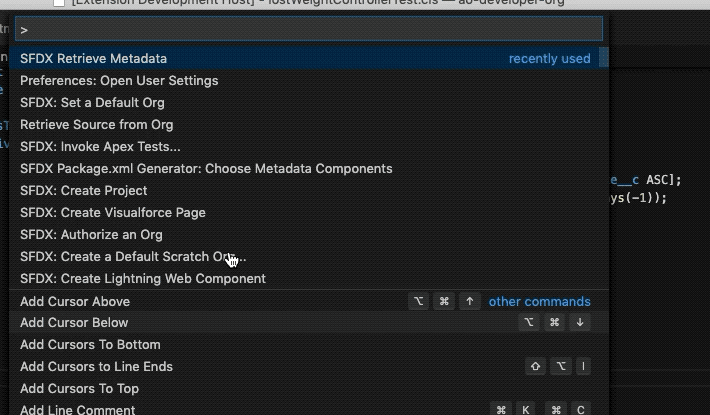

# sfdx-retrieve

Salesforce DX extension for retrieving Metadata using the active credentials.
The extension includes a command for different Metadata types, popping up a Selections menu in the Palette.
There is no need to use a package.xml to perform the retrieve.

## Features

This extension sends the following command to the Terminal: sfdx force:source:retrieve -m META_TYPE.
It has support for the following Metadata types: ApexClass, ApexTrigger, LightningComponentBundle, ApexPage and StaticResource.

## Requirements

SFDX CLI is required and you have to be in a SDFX project folder to use this extension.
It will perform best if the SFDX extension is already loaded (you can see any of the SFDX CLI extension components, like the connection to the default Org in the blue tab on the bottom)

## Repository
https://github.com/aojedo/sfdx-retrieve.git

### 1.0.1

Updated README
